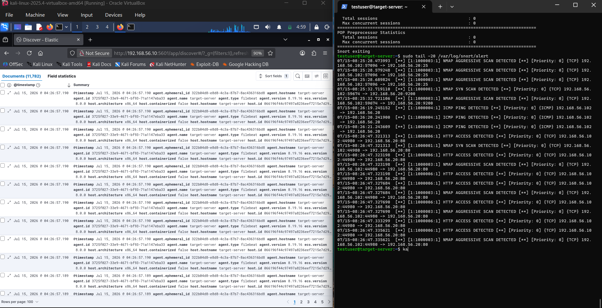
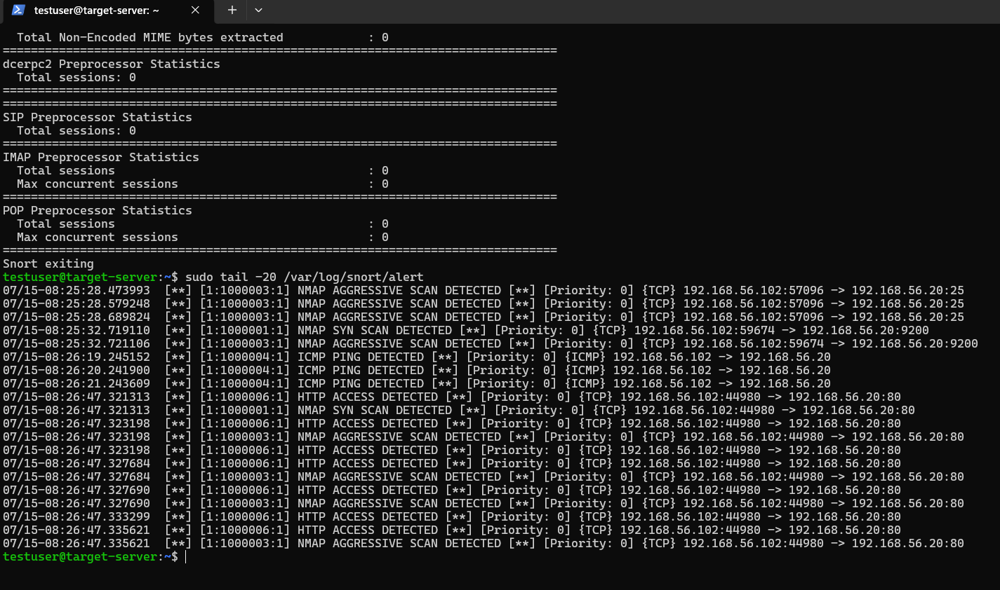
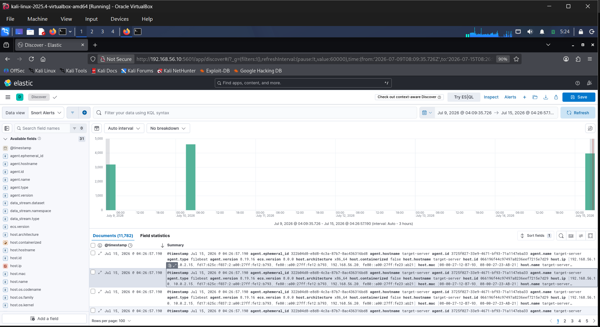
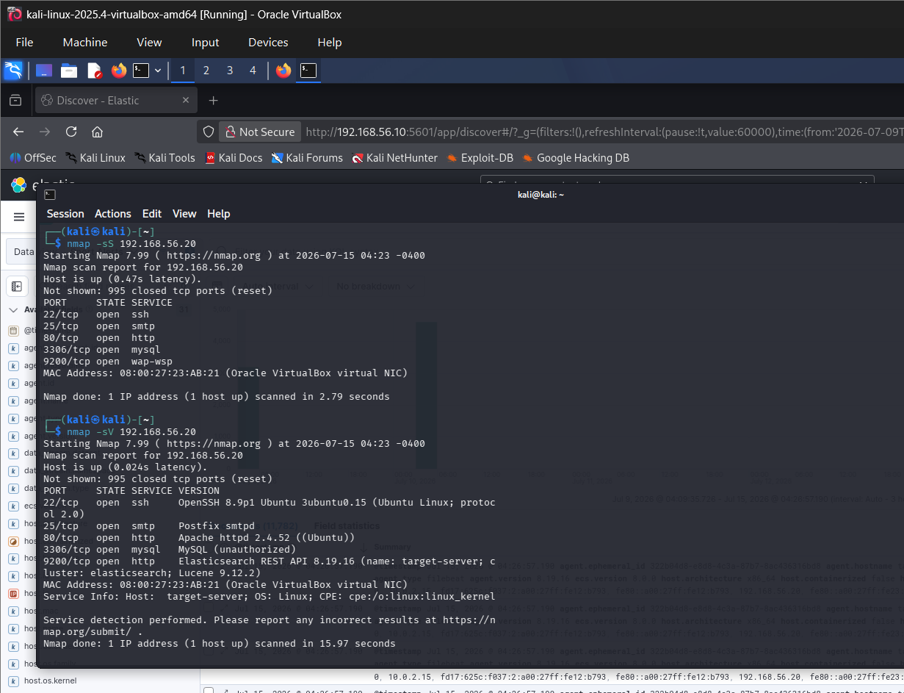
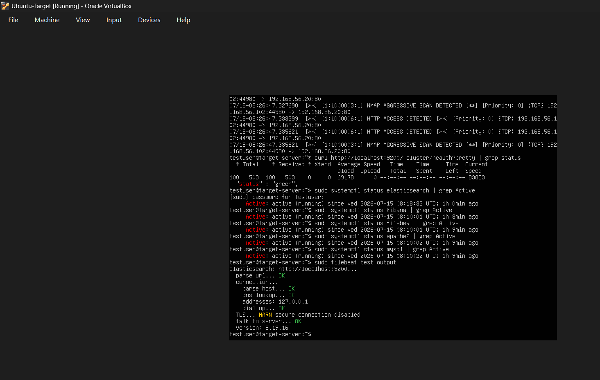

# 🛡️ SIEM Dashboard with IDS Integration

### ELK Stack + Snort IDS on a Virtualised 3-Tier Network


---
# 🎯 Project Overview
This project demonstrates the implementation of a **Security Information and Event Management (SIEM)** solution using the **Elastic Stack (Elasticsearch, Kibana and Filebeat)** integrated with the **Snort Intrusion Detection System (IDS)**.
A virtualised three-tier network was created using Oracle VirtualBox to simulate an enterprise environment. Multiple reconnaissance and attack scenarios were launched from a Kali Linux attacker machine against a target Ubuntu server. Snort detected malicious activity, Filebeat shipped alerts to Elasticsearch, and Kibana provided real-time visualisation through interactive dashboards.
---
# ⭐ Project Highlights

- ✅ Built a complete SIEM solution using ELK Stack
- ✅ Integrated Snort IDS with Elasticsearch and Kibana
- ✅ Simulated real-world cyber attacks
- ✅ Generated over **3,200 IDS alerts**
- ✅ Created live Kibana dashboards
- ✅ Built an isolated enterprise-style security lab
---
# 📸 Dashboard Preview

## 🖥️ SIEM Dashboard

## 🚨 Snort IDS Alerts

## 📊 Kibana Timeline Dashboard

## ⚔️ Nmap Attack Simulation

## ⚙️ All Services Running

# 🏗️ Lab Architecture

```text
                   Kali Linux
              (192.168.56.30)
                     │
      Nmap • Nikto • SSH • ICMP
                     │
                     ▼
        Ubuntu Target Server
      Apache + MySQL Services
          192.168.56.20
                     │
                     ▼
              Snort IDS
                     │
                     ▼
               Filebeat
                     │
                     ▼
            Elasticsearch
                     │
                     ▼
                Kibana
```

---

# 🌐 Network Topology

| Machine | Operating System | IP Address | Purpose |
|---------|------------------|------------|---------|
| SIEM Server | Ubuntu 22.04 | 192.168.56.10 | ELK Stack + Snort |
| Target Server | Ubuntu 20.04 | 192.168.56.20 | Apache & MySQL |
| Attacker Machine | Kali Linux | 192.168.56.30 | Attack Simulation |

All systems communicate over a VirtualBox Host-Only Network (192.168.56.0/24).

---
# 🛠️ Technology Stack

| Component | Technology |
|-----------|------------|
| SIEM | Elasticsearch |
| Dashboard | Kibana |
| Log Shipper | Filebeat |
| IDS | Snort |
| Virtualisation | Oracle VirtualBox |
| Web Server | Apache HTTP Server |
| Database | MySQL |
| Attacker OS | Kali Linux |
| Server OS | Ubuntu Linux |

---
# 🔄 Detection Pipeline
```text
Attack Simulation
       │
       ▼
Snort IDS Detection
       │
       ▼
Alert Generated
       │
       ▼
Filebeat
       │
       ▼
Elasticsearch
       │
       ▼
Kibana Dashboard
```

---
# ⚔️ Attack Simulations
The following attacks were successfully executed and detected.
- Network Discovery (`nmap -sn`)
- SYN Scan (`nmap -sS`)
- Version Detection (`nmap -sV`)
- Aggressive Scan (`nmap -A`)
- Web Enumeration using Nikto
- SSH Login Attempt
---
# 📊 Results

| Metric | Result |
|---------|---------|
| IDS Alerts Generated | 3,200+ |
| Attack Types Tested | 6 |
| Detection Success | Successfully detected all simulated attacks |
| Elasticsearch Cluster Health | Green |
| Dashboard | Real-Time Monitoring |
---
# 📈 Kibana Dashboard Features
The dashboard includes:

- Alerts Timeline
- Source IP Addresses
- Destination Ports
- Protocol Distribution
- Top Snort Signatures
- Event Frequency
- Searchable Alert Logs
---
# 🔍 Lab Security Findings

The intentionally vulnerable lab environment demonstrated several common security issues.
### Elasticsearch REST API
Elastic Security was intentionally disabled for educational purposes.
**Recommendation**
Enable authentication, TLS and firewall restrictions in production.
### Apache HTTP Server
Apache HTTP Server 2.4.52 was identified during testing.
**Recommendation**
Regularly update software and review published security advisories.
---
### SMTP Service
SMTP was exposed on Port 25.
**Recommendation**
Restrict access to authorised systems only.
---
# 🧠 Challenges Encountered
- Configuring Snort detection rules
- Troubleshooting Filebeat log permissions
- Configuring Kibana Data Views
- Verifying Elasticsearch indexing
- Configuring VirtualBox networking
---
# 📚 Lessons Learned
This project strengthened practical knowledge in:
- SIEM Engineering
- ELK Stack Administration
- Linux System Administration
- IDS Rule Development
- Network Traffic Analysis
- Log Management
- Threat Detection
- Security Monitoring
---
# 💼 Skills Demonstrated
- SIEM Deployment
- Elasticsearch
- Kibana
- Filebeat
- Snort IDS
- Linux Administration
- Bash Scripting
- Network Security
- Log Analysis
- Threat Detection
- Apache HTTP Server
- MySQL
- Oracle VirtualBox
---
# 📂 Repository Structure
```text
SIEM-Dashboard-IDS-Integration/

├── README.md
├── docs/
│   └── setup_guide.md
├── _all_services_running.png
├── _kibana_timeline_dashboard.png
├── _nmap_attack_simulation.png
├── _siem_ids_combined.png
└── _snort_alerts_detected.png
```
---
# 📖 Documentation
Detailed installation and configuration instructions are available here:
➡️ **[Setup Guide](docs/setup_guide.md)**
---
# 🚀 Future Improvements
- Integrate Wazuh
- Deploy Suricata IDS
- Add Zeek Network Monitoring
- MITRE ATT&CK Mapping
- Sigma Detection Rules
- Docker Deployment
- Automated Email Alerts
---
# ⚠️ Disclaimer
This project was developed entirely within an isolated virtual laboratory for educational purposes. All attack simulations were performed only against systems owned and controlled by the author. No testing was conducted against production or third-party systems.
---
# 👩‍💻 Author
**Vinayshree Malge**
- GitHub: https://github.com/VinayshreeMalge
- LinkedIn: *(https://www.linkedin.com/in/vinayshree-malge)*
---
# 📚 References
- https://www.elastic.co/guide
- https://www.snort.org/documents
- https://www.kali.org/docs
- https://www.nist.gov/cyberframework
---
## ⭐ If you found this project useful, please consider giving it a star!
